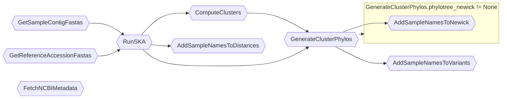
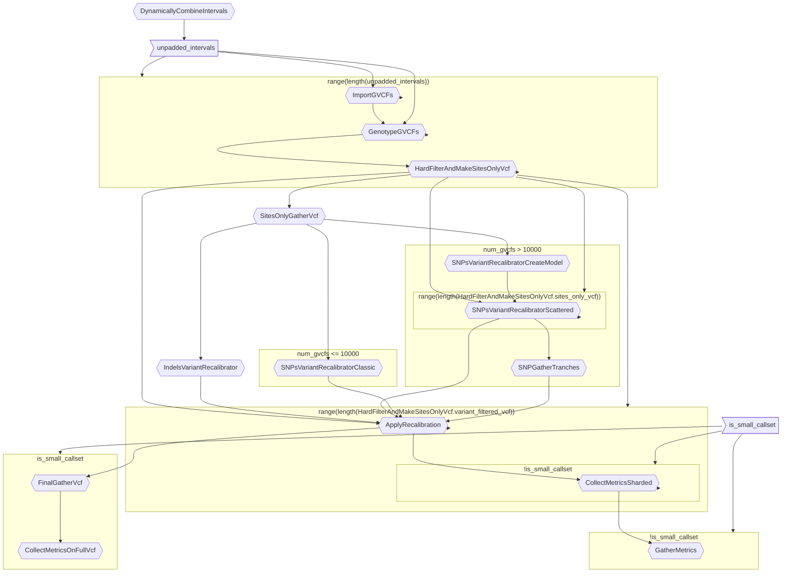

## MiniWDL Viz

* A package for parsing and visualizing WDL files 
* Uses MiniWDL to parse a WDL file into edges, nodes, inputs, and outputs
* Creates a `mermaid.js` file to plot a flowchart of the WDL file

### Installation
To install, run 

```pip install git+https://github.com/chanzuckerberg/miniwdl-viz.git```

or 
```
git clone https://github.com/chanzuckerberg/miniwdl-viz.git
cd miniwdl-viz

python3 setup.py install
```

### Running 

To run just the parser, run 
```
miniwdl_parser /path/to/wdl
```

To run the wdl to mermaid plot run:

```
wdl_to_mermaid /path/to/wdl --plot-flowchart
```
This uses matplotlib and makes a call to the `mermaid.ink` site to generate the plot

To simply output the mermaid flowchart as a string, run

```
wdl_to_mermaid /path/to/wdl --print-flowchart
```

More options can be found using 

```
miniwdl_parser -h
```

or 

```
wdl_to_mermaid -h
```

The parser should be able to handle most WDL workflows that `miniwdl` can handle. An example of a simple vs a more complex WDL file is below:

### Simple

This was generated with the command `wdl_to_mermaid wdl/phylotree-ng/run.wdl --print-flowchart --flowchart-dir TD`


### Complex
This was generated with the command: ```wdl_to_mermaid wdl/phylotree-ng/run.wdl --print-flowchart```

### Contributing
This project adheres to the Contributor Covenant code of conduct. By participating, you are expected to uphold this code. Please report unacceptable behavior to opensource@chanzuckerberg.com.

### Reporting Security Issues
Please disclose security issues responsibly by contacting security@chanzuckerberg.com.