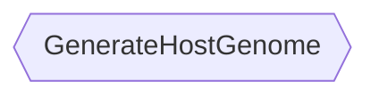

## MiniWDL Viz

### Simple

```mermaid 
flowchart LR
    classDef done fill:#f96
    call-GenerateHostGenome{{"GenerateHostGenome"}}
```

### Complex

```mermaid 
flowchart LR
    classDef done fill:#f96
    call-DynamicallyCombineIntervals{{"DynamicallyCombineIntervals"}}
    decl-unpadded_intervals>"unpadded_intervals"]
    subgraph scatter-L120C3-idx["range(length(unpadded_intervals))"]
    call-ImportGVCFs{{"ImportGVCFs"}}
    call-GenotypeGVCFs{{"GenotypeGVCFs"}}
    call-HardFilterAndMakeSitesOnlyVcf{{"HardFilterAndMakeSitesOnlyVcf"}}
    end
    call-SitesOnlyGatherVcf{{"SitesOnlyGatherVcf"}}
    call-IndelsVariantRecalibrator{{"IndelsVariantRecalibrator"}}
    subgraph if-L195C3["num_gvcfs > 10000"]
    call-SNPsVariantRecalibratorCreateModel{{"SNPsVariantRecalibratorCreateModel"}}
    scatter-L219C3-idx
    call-SNPGatherTranches{{"SNPGatherTranches"}}
    end
    subgraph scatter-L219C3-idx["range(length(HardFilterAndMakeSitesOnlyVcf.sites_only_vcf))"]
    call-SNPsVariantRecalibratorScattered{{"SNPsVariantRecalibratorScattered"}}
    end
    subgraph if-L252C3["num_gvcfs <= 10000"]
    call-SNPsVariantRecalibratorClassic{{"SNPsVariantRecalibratorClassic"}}
    end
    decl-is_small_callset>"is_small_callset"]
    subgraph scatter-L279C3-idx["range(length(HardFilterAndMakeSitesOnlyVcf.variant_filtered_vcf))"]
    call-ApplyRecalibration{{"ApplyRecalibration"}}
    if-L299C5
    end
    subgraph if-L299C5["!is_small_callset"]
    call-CollectMetricsSharded{{"CollectMetricsSharded"}}
    end
    subgraph if-L317C3["is_small_callset"]
    call-FinalGatherVcf{{"FinalGatherVcf"}}
    call-CollectMetricsOnFullVcf{{"CollectMetricsOnFullVcf"}}
    end
    subgraph if-L344C3["!is_small_callset"]
    call-GatherMetrics{{"GatherMetrics"}}
    end
    call-DynamicallyCombineIntervals -->  decl-unpadded_intervals
    decl-unpadded_intervals -->  scatter-L120C3-idx
    decl-unpadded_intervals -->  call-ImportGVCFs
    scatter-L120C3-idx -->  call-ImportGVCFs
    call-ImportGVCFs -->  call-GenotypeGVCFs
    decl-unpadded_intervals -->  call-GenotypeGVCFs
    scatter-L120C3-idx -->  call-GenotypeGVCFs
    call-GenotypeGVCFs -->  call-HardFilterAndMakeSitesOnlyVcf
    scatter-L120C3-idx -->  call-HardFilterAndMakeSitesOnlyVcf
    call-HardFilterAndMakeSitesOnlyVcf -->  call-SitesOnlyGatherVcf
    call-SitesOnlyGatherVcf -->  call-IndelsVariantRecalibrator
    call-SitesOnlyGatherVcf -->  call-SNPsVariantRecalibratorCreateModel
    call-HardFilterAndMakeSitesOnlyVcf -->  scatter-L219C3-idx
    call-HardFilterAndMakeSitesOnlyVcf -->  call-SNPsVariantRecalibratorScattered
    scatter-L219C3-idx -->  call-SNPsVariantRecalibratorScattered
    call-SNPsVariantRecalibratorCreateModel -->  call-SNPsVariantRecalibratorScattered
    call-SNPsVariantRecalibratorScattered -->  call-SNPGatherTranches
    call-SitesOnlyGatherVcf -->  call-SNPsVariantRecalibratorClassic
    call-HardFilterAndMakeSitesOnlyVcf -->  scatter-L279C3-idx
    scatter-L279C3-idx -->  call-ApplyRecalibration
    call-HardFilterAndMakeSitesOnlyVcf -->  call-ApplyRecalibration
    call-IndelsVariantRecalibrator -->  call-ApplyRecalibration
    call-SNPsVariantRecalibratorScattered -->  call-ApplyRecalibration
    call-SNPsVariantRecalibratorClassic -->  call-ApplyRecalibration
    call-SNPGatherTranches -->  call-ApplyRecalibration
    decl-is_small_callset -->  if-L299C5
    call-ApplyRecalibration -->  call-CollectMetricsSharded
    scatter-L279C3-idx -->  call-CollectMetricsSharded
    decl-is_small_callset -->  if-L317C3
    call-ApplyRecalibration -->  call-FinalGatherVcf
    call-FinalGatherVcf -->  call-CollectMetricsOnFullVcf
    decl-is_small_callset -->  if-L344C3
    call-CollectMetricsSharded -->  call-GatherMetrics
```